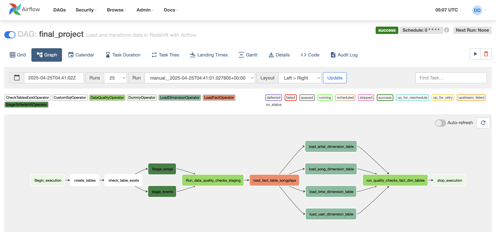
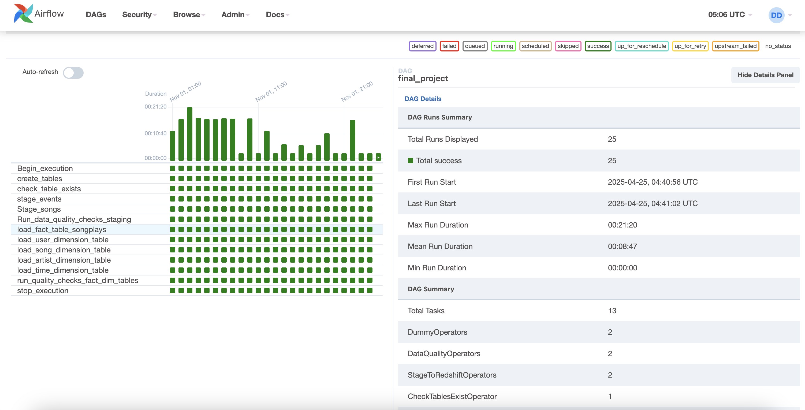

# Data Pipeline Project with Apache Airflow & AWS Redshift

This project demonstrates a robust and modular data pipeline built using **Apache Airflow**, **Amazon S3**, and **Amazon Redshift**. It was developed to highlight skills in orchestrating data pipelines, building custom Airflow operators, and ensuring data quality through automated validation.

---

## Project Overview

The pipeline extracts raw JSON logs and song metadata from S3, stages them into Redshift, performs data transformations to populate a star schema, and runs quality checks to validate the results.

---

## Technologies & Services Used

- **Apache Airflow** (DAG orchestration and scheduling)
- **Amazon Redshift** (Data warehouse and transformation)
- **Amazon S3** (Raw data storage)
- **Python** (Custom operator development)
- **SQL** (Data transformation and validation)

---

## Project Structure
<pre>
\```text
.  
├── dags/
│   └── final_project.py                # Main DAG definition
├── plugins/
│   └── final_project_operators/
│       ├── stage_redshift.py          # Stage S3 data into Redshift
│       ├── load_fact.py               # Load fact table
│       ├── load_dimension.py          # Load dimension tables
│       ├── data_quality.py            # Run data quality checks
│       ├── check_tables_exist.py      # Ensure required tables exist
│       └── custom_table_create.py     # Create tables in Redshift
├── helpers/
│   └── final_project_sql_statements.py # SQL helper class
├── assets/
│   ├── dag.png                        # DAG graph view
│   └── dag_runs.png                   # DAG run history
\```
</pre>

---

## DAG Workflow

The DAG follows a well-structured, modular flow:

1. **Begin Execution**
2. **Create Tables** in Redshift
3. **Check Table Existence**
4. **Stage Events and Songs** from S3 to Redshift
5. **Run Data Quality Checks** on staging tables
6. **Load Fact Table**
7. **Load All Dimension Tables** (user, song, artist, time)
8. **Run Final Data Quality Checks**
9. **Stop Execution**

<p align="center"></p>


---

## Features

- **Idempotent Runs**: Staging tables are always recreated, while fact/dim tables are created only if not present.
- **Dynamic S3 Templating**: Templated S3 paths allow loading of partitioned log data using `logical_date`.
- **Custom Operators**: Each pipeline step is modular and reusable across projects.
- **Data Quality Validation**: Ensures critical tables have valid row counts and no NULL values in primary keys.
- **Execution Provenance**: Fully backfillable using Airflow CLI or scheduled runs.

---

## Result
- Successfully processed 25 DAG runs
- All staging, transformation, and validation tasks completed successfully
- Queryable star schema created in Redshift

<p align="center"></p>
